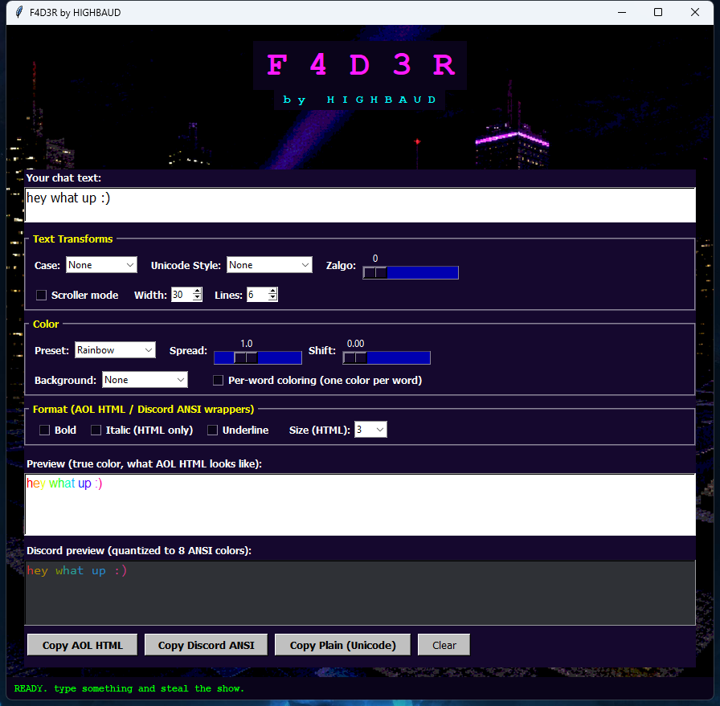

# F4D3R by HIGHBAUD

A late-90s AOL chat fader, recreated for 2026. Generates per-character color-faded text in three formats — period-accurate AOL HTML, modern Discord ANSI blocks, and plain styled Unicode that works anywhere.



## What it does

The original AOL "fader" was an underground prog that wrapped every character of your chat in a `<FONT COLOR="#XXXXXX">` tag, stepping the color around the spectrum so your messages dripped through a rainbow. AIM is shut down. This isn't.

F4D3R outputs three flavors:

- **AOL HTML** — classic per-char `<FONT>` soup with optional `<B>`/`<I>`/`<U>` and background colors. Paste into anything that renders HTML (email, old forums, rich-text chat).
- **Discord ANSI** — wraps the colored text in a ```` ```ansi ```` code block using the 8 colors Discord actually renders. Supports bold, underline, fg + bg.
- **Plain Unicode** — text transformed via Math Alphanumeric Symbols (𝐛𝐨𝐥𝐝, 𝘪𝘵𝘢𝘭𝘪𝘤, 𝓼𝓬𝓻𝓲𝓹𝓽, 𝔣𝔯𝔞𝔨𝔱𝔲𝔯, 𝙢𝙤𝙣𝙤, Ⓒⓘⓡⓒⓛⓔⓓ, ｆｕｌｌｗｉｄｔｈ, etc). Survives platforms that strip color — Twitter/X bios, Discord display names, Instagram.

## Features

| Group | Controls |
|---|---|
| Text Transforms | Case (None / lower / UPPER / Title / sPoNgEbOb / RaNdOm), 12 Unicode styles, Zalgo intensity, Scroller mode (width + lines) |
| Color | 9 presets (Rainbow, Fire, Ocean, Forest, Sunset, Cotton Candy, Toxic, Vaporwave, AOL Classic), Spread, Shift, Background fade (None / Opposite hue / Reverse fade / Dark contrast), Per-word coloring |
| Format | Bold / Italic / Underline checkboxes, HTML font size 1–7 |
| Output | Copy AOL HTML, Copy Discord ANSI, Copy Plain Unicode |

Pipeline: `case → unicode style → zalgo → scroller → color → emit`. Everything composes.

## Download

Grab the latest Windows EXE from [Releases](https://github.com/highbaud/F4D3R-by-HIGHBAUD/releases) — standalone, no install needed.

## Run from source

```bash
pip install Pillow
python fader.py
```

Requires Python 3.10+ and Pillow (used for the background image and splash fade).

## Build your own EXE

```bash
pip install pyinstaller
pyinstaller --onefile --windowed --name F4D3R ^
  --add-data "background.png;." ^
  --add-data "splash.png;." ^
  fader.py
```

Output lands in `dist/F4D3R.exe` (~28 MB, single file, bundles Python + Pillow + the images).

## License

MIT — see [LICENSE](LICENSE).
